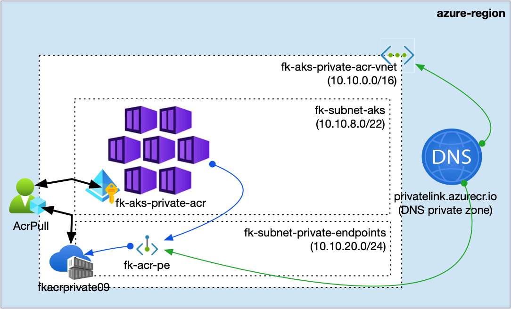
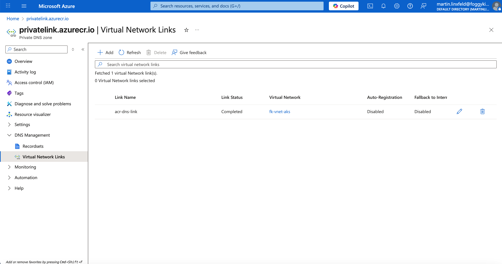
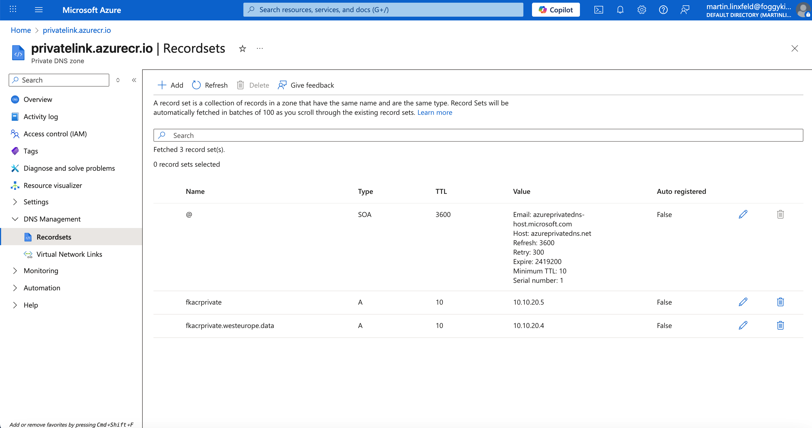

# Lesson 09: Private ACR with AKS and Private Endpoint

This extra lesson is outside the current 2025 course core. It shows how to keep the image-pull path private by combining:

- `terraform-az-fk-aks`
- `terraform-az-fk-vnet`
- `terraform-az-fk-acr`
- `terraform-az-fk-private-endpoint`
- `terraform-az-fk-private-dns`
- `terraform-az-fk-rbac`

The goal is a clean private path for AKS to reach ACR through a Private Endpoint and Private DNS, without exposing the registry to the public internet.
The `AcrPull` role assignment is part of the design, and the DNS zone is the Azure Private DNS zone `privatelink.azurecr.io`.

---

## Architecture Overview

This deployment creates:

- a dedicated resource group
- an AKS cluster in a VNet subnet
- a separate subnet for Private Endpoints
- an Azure Container Registry in Premium SKU
- a Private Endpoint for the ACR `registry` subresource
- a Private DNS zone `privatelink.azurecr.io` with a VNet link
- an `AcrPull` role assignment for the AKS kubelet identity via `terraform-az-fk-rbac`



Private Endpoint traffic stays on the Azure backbone, and the standard ACR FQDN resolves to the private IP through Private DNS.

---

## Private DNS Flow






These screenshots show the DNS zone, the VNet link, and the A record that maps the registry name to the Private Endpoint IP address.

---

## Deployment

From the `training/09-private-acr-with-private-endpoint` directory:

```bash
tofu init
tofu plan -var-file=terraform.tfvars.example
tofu apply
```

If the ACR name is already taken globally, update `acr_name` in your local `terraform.tfvars` or override it with `-var-file=terraform.tfvars.example`.

---

## Verification

After `tofu apply`, verify:

```bash
tofu output
az role assignment list \
  --scope $(tofu output -raw acr_id) \
  --query "[].{role:roleDefinitionName, principal:principalId}" \
  -o table
```

The most important output is the Private Endpoint IP:

- `acr_private_endpoint_ip`

You can also check the Private DNS records and the ACR private access configuration in the Azure Portal.

---

## Azure Portal View


The portal view should show the ACR, the Private Endpoint, and the private DNS integration.

---

## Cleanup

```bash
tofu destroy
```

---

## License

Licensed under the **Universal Permissive License (UPL), Version 1.0**.
